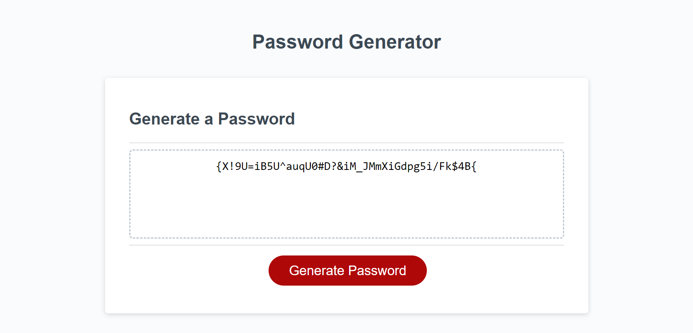

# Modify-Password-Generator

## Optimize Starter code for Password Generator.

### Change made to JavaScript file.

1. Added variables.
2. Created Arrays.
3. Added functions to allow for all the different possiblities.
4. Added a for loop to create the random password to meet the users criteria.

### Completed webpage

### Link to website

1. GitHub Repository: https://github.com/Maxie92/Modify-Password-Generator
2. Website: https://Maxie92.github.io/Modify-Password-Generator
